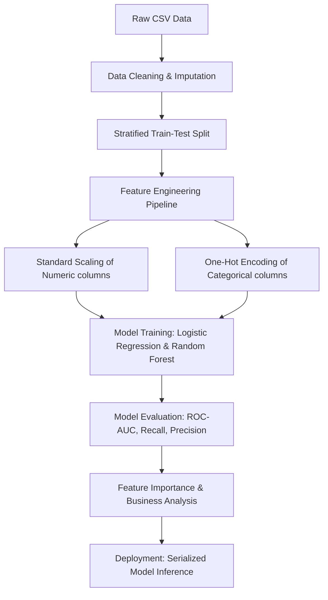

# Telco Customer Churn Prediction & Retention Analytics

An end-to-end machine learning project to predict customer churn in a telecommunications company, identify key drivers of customer attrition, and establish a data-driven business decision framework for customer retention.

## 📌 Project Overview
This project addresses a classic business challenge: customer churn. Using the **Telco Customer Churn dataset**, we built and evaluated regularized **Logistic Regression** and **Random Forest** classifiers. Beyond model metrics, this project includes a **Feature Importance Analysis** to uncover why customers cancel their subscriptions, providing actionable insights for marketing and retention teams.

---

## 💼 Problem Statement
Acquiring new customers in the telecom sector is expensive—typically costing **5x to 25x more** than retaining existing ones.
- **The Challenge:** Telecom customer attrition rates are high due to competitor promotions, billing friction, and service dissatisfaction.
- **The Objective:** Predict which customers are at high risk of churning *before* they leave, allowing customer success teams to target them with retention incentives (discounts, contract upgrades, proactive support).

---

## 📊 Dataset Description
The dataset contains **7,043 customer records** with **21 attributes**:
- **Demographics:** Gender, Senior Citizen status, Partner, Dependents.
- **Services Subscribed:** Phone, Multiple Lines, Internet (DSL, Fiber optic, None), Online Security, Online Backup, Device Protection, Tech Support, Streaming TV, Streaming Movies.
- **Account Information:** Tenure (months), Contract type (Month-to-month, One year, Two year), Paperless Billing, Payment Method, Monthly Charges, Total Charges.
- **Target Label:** `Churn` (Yes/No) - Whether the customer cancelled service within the last month.

---

## 🛠️ Methodology & Pipeline



1. **Data Cleaning:** Identified and imputed 11 missing values in `TotalCharges` (new customers with `tenure = 0` set to `$0.0`), dropped uninformative `customerID` identifiers.
2. **Stratified Split:** Split data into an **80/20 train/test ratio**, using stratified sampling to preserve the target class proportions.
3. **Feature Preprocessing:** Built a robust `ColumnTransformer` pipeline:
   - **Numerical columns** (`tenure`, `MonthlyCharges`, `TotalCharges`) scaled via `StandardScaler`.
   - **Categorical columns** encoded using `OneHotEncoder` (dropping the first category to avoid multicollinearity).
4. **Model Prototyping & Training:** Trained regularized Logistic Regression and Random Forest Classifiers.
5. **Evaluation Metrics:** Evaluated models using Accuracy, Precision, Recall, F1-Score, and ROC-AUC.
6. **Feature Coefficient Extraction:** Conducted feature importance analysis on the best model to extract business insights.

---

## 🔍 Key EDA Insights
- **Class Imbalance:** **26.5%** churn rate vs **73.5%** retention rate in the dataset.
- **Contract Volatility:** Month-to-month contract holders have a massive churn rate of **42.7%**, compared to only **11.3%** for one-year and **2.8%** for two-year contract holders.
- **Service Friction:** Fiber optic internet users exhibit an alarmingly high churn rate (**41.9%**), which is more than double the DSL churn rate (**19.0%**).
- **Stickiness of Add-Ons:** Customers subscribing to value-added services like `OnlineSecurity` (~14.6% churn) and `TechSupport` (~15.2% churn) are highly loyal compared to those without (~41% churn).

---

## 🤖 Models & Evaluation Results

We evaluated models on a test set of **1,409 customers**:

| Model | Accuracy | Precision | Recall | F1-Score | ROC-AUC |
| :--- | :---: | :---: | :---: | :---: | :---: |
| **Logistic Regression** | **80.55%** | **65.72%** | 55.88% | 60.40% | **0.8421** |
| **Random Forest** | 75.59% | 52.68% | **78.88%** | **63.17%** | 0.8407 |

### 📈 Business Decision Trade-offs:
- **Logistic Regression (Saved as `best_model.pkl`):** Selected as the overall best model based on **ROC-AUC (0.8421)**. It provides a highly precise baseline (65.72% Precision), minimizing cost waste on false positives.
- **Random Forest (Balanced):** Delivers a high **Recall (78.88%)** due to adjusted class weights. It is the optimal model if the company's retention incentive is inexpensive (e.g. email outreach or discount coupon) because it captures 78.88% of all churners.

---

## 💡 Top 5 Key Business Findings
1. **Contract Lock-In is the Strongest Retainer:** A two-year contract is the single strongest negative driver of churn (coefficient **-1.34**), proving that securing multi-year commitments drastically stabilizes retention.
2. **Fiber Optic Service Requires Quality Audit:** Fiber optic internet is heavily correlated with cancellations (coefficient **+1.19**). This points to service quality problems or pricing shocks when promotional tiers expire.
3. **Onboarding Stage has the Highest Risk:** Tenure is inversely related to churn (coefficient **-1.24**). Retention efforts should be heavily focused on onboarding new customers in the **first 6 months**.
4. **Billing Method Friction Drives Attrition:** Customers paying via "Electronic Check" churn at significantly higher rates (+0.38) than those on Autopay (Credit Card/Direct Debit), suggesting billing friction increases churn.
5. **Streaming Bundling Leads to Churn:** Subscribing to Streaming TV (+0.38) and Movies (+0.38) increases churn risk, indicating that entertainment seekers view telecom pipelines as commodities and exhibit high price sensitivity.

---

## 💻 Technologies Used
- **Language:** Python
- **Libraries:** Pandas, NumPy, Scikit-Learn, Matplotlib, Seaborn, Joblib, IPykernel
- **Format:** Modular scripts (`src/`) & Jupyter Notebooks (`notebooks/`)

---

## 🚀 How to Run

### 1. Setup Virtual Environment
```bash
# Clone and navigate to the directory
cd customer_churn_prediction

# Create a virtual environment
python -m venv venv

# Activate the virtual environment
# Windows (PowerShell):
.\venv\Scripts\Activate.ps1
# Mac/Linux:
source venv/bin/activate

# Install requirements
pip install -r requirements.txt
```

### 2. Download and Place the Dataset
1. Download the Telco Customer Churn CSV dataset from [Kaggle](https://www.kaggle.com/datasets/blastchar/telco-customer-churn).
2. Save the CSV as `data/raw/WA_Fn-UseC_-Telco-Customer-Churn.csv`.

### 3. Run the Pipelines
```bash
# Run the training pipeline (processes data, trains models, displays results, saves models)
python src/train.py

# Run a test inference on a sample mock customer profile
python src/predict.py
```
